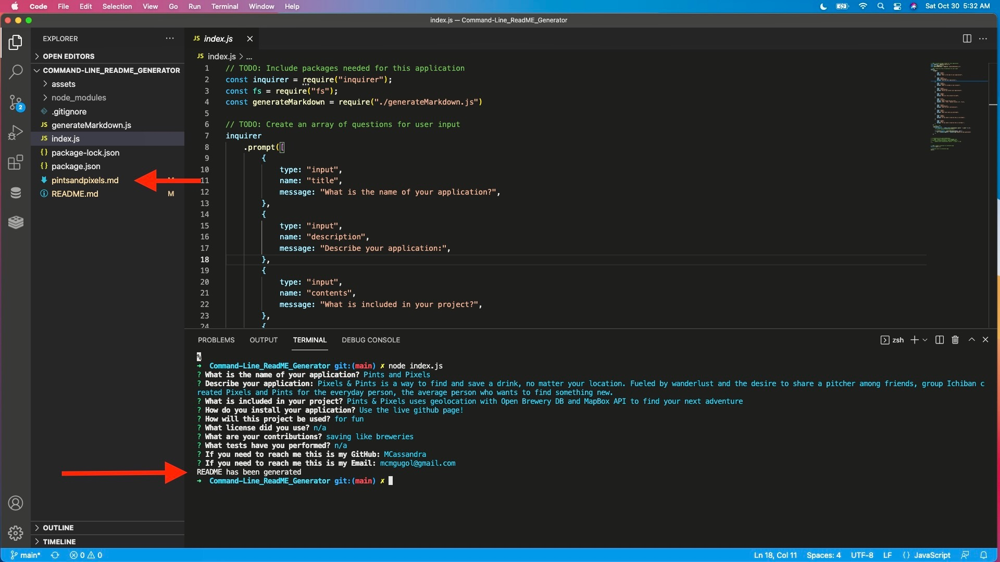

# Command-Line_ReadME_Generator

## Description
This application is a command-line README generator using Node.js and Inquirer. This app takes user input to create a README file the user can use for every project they produce. 

## How it works
1. Clone this repository
2. In the terminal, run node index.js
3. Answer the questions prompted
4. Copy the generated README file into your project files

Repository: https://github.com/MCassandra/Command-Line_ReadME_Generator
Video tutorial: 